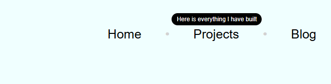

# Tooltip UI

## HTML and CSS

## Description

- This project was built with HTML and CSS
- The motivation behind this project was to help creat a pop up with additional information for the end user
- This will help minimize the use of JS
- Creating this project helped me how to make tooltips and make animations to make it more visually appealing 

## Usage

- Click on the link to head over to the Project Repository https://github.com/0mar77/tooltip-ui
- Clone the Repo
- Launch in local environment

## Project URL
https://roadmap.sh/projects/tooltip-ui